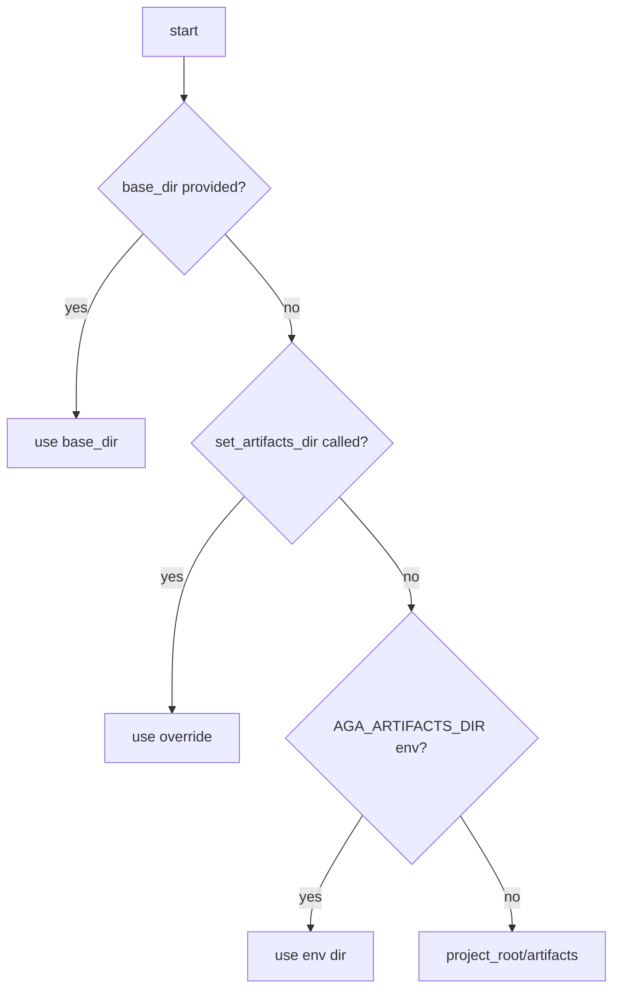
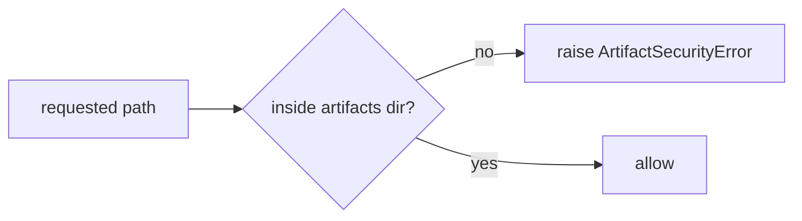

# Artifacts Guide

Utilities in `utils.artifacts` manage generated files with strict directory
rules.

## Resolution Flow



## Security

Paths must remain within the resolved artifacts directory.



## Basic Usage

```python
from utils.artifacts import save_artifact, load_artifact

save_artifact("hello", "greeting.txt")
print(load_artifact("greeting.txt", as_="text"))
```
